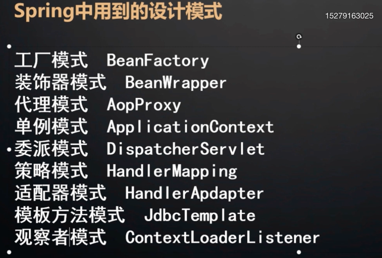

#设计模式
为了写出更好的代码，更好的重构项目  
分为三大类创建型模式 结构型模式 行为型模式
# 七大软件设计原则
1.开闭原则  
对修改关闭，对扩展开放

2.单一职责原则  
一个类，一个接口，一个方法只做一件事

3.依赖倒置原则  
抽象使各个类之间相互不影响松耦合，尽量面向接口编程

4.接口隔离原则  
在抽象编程基础上，接口单一，只做某一类事情，他对应的客户端不应该依赖不需要的接口

5.迪米特法则  
最少知道原则，一个类对其所依赖的类知道的越少越好，对可读性更好的提升

6.里式替换原则  
子类可以扩展父类的功能，但是不能改变父类的功能，杜绝继承泛滥

7.合成复用原则  
尽量使用对象组合聚合而不使用继承关系达到目的

# spring用到的设计模式

